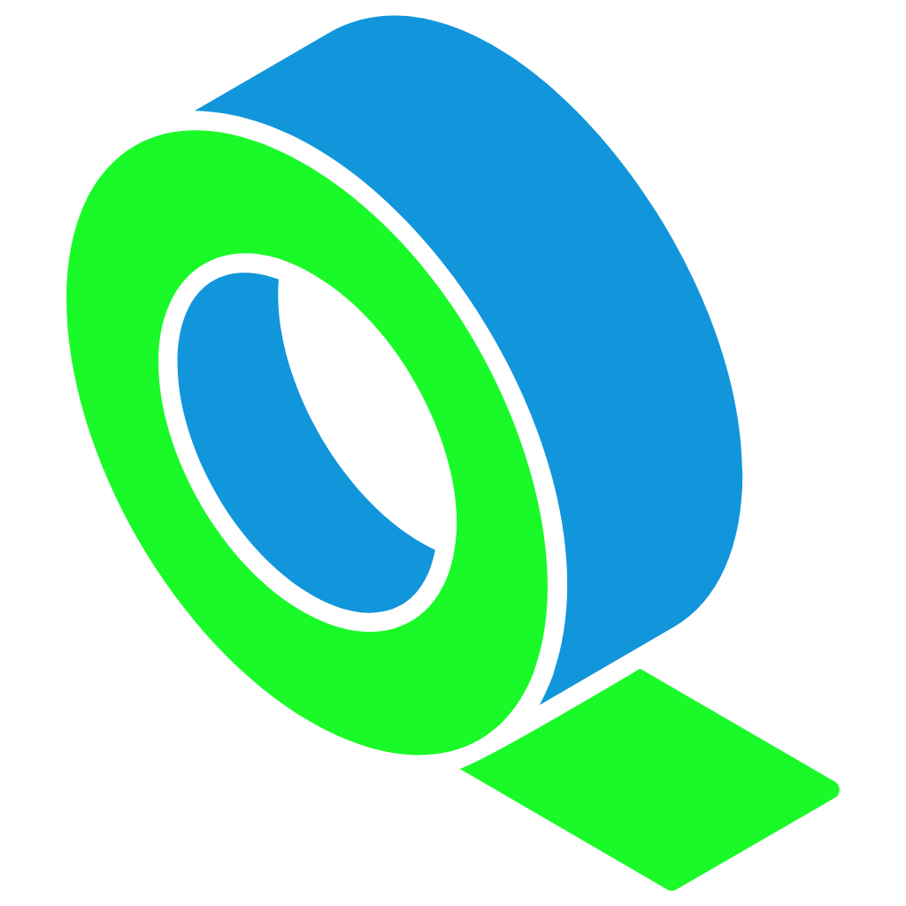

[//]: # (![]&#40;https://img.shields.io/github/v/release/lopo12123/tape&#41;)

[//]: # ()

    <h1>🎥 Tape</h1>
    
tape is an application for recording mouse and/or keyboard actions, which can generate a recording file for later playback.

    

        
        
    

---

## Architecture

to be continued...

## License

See [LICENSE](./LICENSE) for details.

## Thanks

- [JetBrains](https://jb.gg/OpenSourceSupport) -- Thanks to jetbrains for providing developer tools
- [egui](https://github.com/emilk/egui) -- **GUI** implementation of the application
- [device_query](https://github.com/ostrosco/device_query) -- **Monitoring** of mouse/keyboard actions
- [enigo](https://github.com/enigo-rs/enigo) -- **Simulation** of mouse/keyboard actions